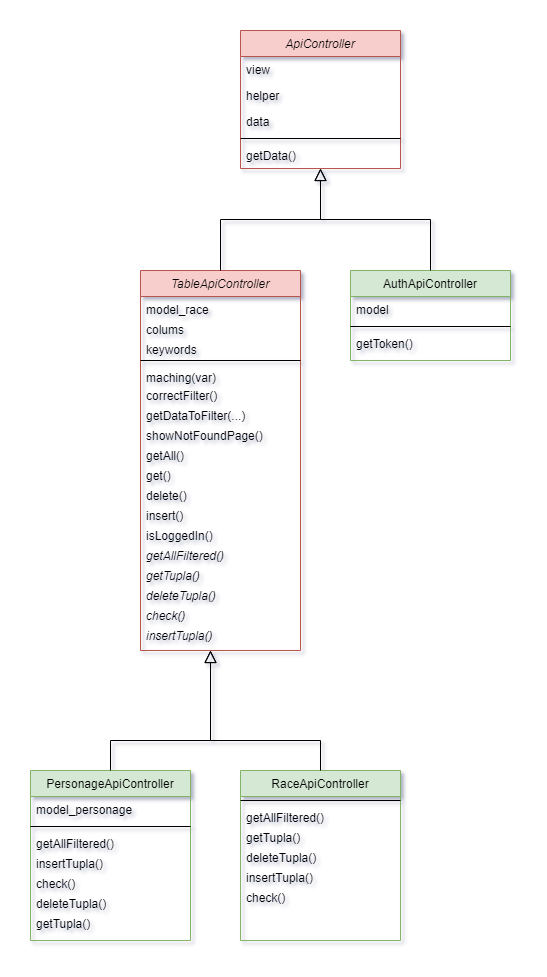

# TRABAJO PRÁCTICO ESPECIAL PARTE 2:

## API RESTful

<h2 align="center">Indice</h2>

- [Diagrama de Clases de Controladores](#diagrama-de-clases-de-controladores)
- [Diagrama de Clases de modelos](#diagrama-de-clases-de-modelos)
- [Tabla de Personajes](#endpoints-generados-para-la-tabla-personaje)
    - [Obtener todos](#devuelve-todos-los-personajesitems)
        - [Ordenamiento](#ordenamiento)
        - [Paginación](#paginación)
        - [Filtrado](#filtrado)
        - [Combinado](#Se-permite-cualquier-combinación)
    - [Obtener por ID](#devuelve-un-personajeitem-determinado-por-un-id)
    - [Insertado](#servicio-para-agregar-un-personajeitem)
    - [Borrado](#servicio-para-borrar-un-personajeitem)
- [Tabla de Razas](#endpoints-generados-para-la-tabla-raza)
    - [Obtener todas](#devuelve-todos-las-razascategorias)
        - [Ordenamiento](#ordenamiento)
        - [Paginación](#paginación)
        - [Filtrado](#filtrado)
        - [Combinado](#Se-permite-cualquier-combinación)
    - [Obtener por ID](#devuelve-una-razacategoria-determinado-por-un-id)
    - [Insertado](#servicio-para-agregar-una-razaitem)
    - [Borrado](#servicio-para-borrar-una-razaitem)
- [Pedir Token](#servicio-de-generar-y-pedir-token)

--------------------------------------------------------------------------------------------------------------------

<h3 align="center">Diagrama de clases de controladores</h3>

<div align="center">

</div>

--------------------------------------------------------------------------------------------------------------------

<h3 align="center">Diagrama de clases de modelos</h3>

<div align="center">

</div>

--------------------------------------------------------------------------------------------------------------------

### Endpoints Generados Para la Tabla Personaje:

--------------------------------------------------------------------------------------------------------------------

#### Devuelve todos los personajes(items)

* GET   ```api/personages  ```  

--------------------------------------------------------------------------------------------------------------------

#### **Ordenamiento**:

*Devuelve todos los personajes(items) ordenados por columna con un determinado valor*

* GET   ``` api/personages?sort=NOMBREDECOLUMNA ```

**Los nombres de columnas a elegir son : id_personaje - nombre_p - apellido - clase - id_raza - nombre_r - faccion**

*Devuelve todos los personajes(items) ordenados por nombre de los personajes, de forma ascendente*

Algunos Ejemplos:

* GET ```   api/personages?sort=nombre_p ```
* GET ```  api/personages?sort=nombre_p&order=asc ```

*Devuelve todos los personajes(items) ordenados por la clase de los personajes, de forma descendente*

Ejemplo:

* GET ```  api/personages?sort=clase&order=desc ```

--------------------------------------------------------------------------------------------------------------------
#### **Paginación**:

*Devuelve, de todos los personajes(items), una página con un determino tamaño que se le puede indicar y que por defecto es limit=4*

* GET  ``` api/personages?pag=NUMERODEPAGINA ```

*Devuelve, de todos los personajes(items), una página con un tamaño de pagina igual a 4 (lo toma por defecto)*

Ejemplos:

* GET ```  api/personages?pag=2 ```
* GET ```  api/personages?pag=3 ```

*Devuelve, de todos los personajes(items), una página con un tamaño de pagina determino*

Ejemplos:

* GET  ``` api/personages?pag=1&limit=8 ```
* GET  ``` api/personages?pag=3&limit=2 ```

--------------------------------------------------------------------------------------------------------------------
#### **Filtrado**:

*Devuelve todos los personajes(items) filtrados por un valor de una columna dada*

* GET ```  api/personages?nombredecolumna=VALORAFILTRAR ```

**Los nombres de columnas a elegir son : id_personaje - nombre_p - apellido - clase - id_raza - nombre_r - faccion** 

Algunos Ejemplos:

* GET ```  api/personages?id_personaje=2 ```
* GET ```  api/personages?clase=Guerrero ```
* GET ```  api/personages?id_raza=2 ```
* GET ```  api/personages?faccion=Alianza ```

**Aclaración: no se puede filtrar por más de un campo a la vez**

--------------------------------------------------------------------------------------------------------------------

**Se permite cualquier combinación de paginación , ordenamiento y filtrado posible**

Algunos Ejemplos son:

* GET ``` api/personages?id_raza=4&sort=id_personaje&order=desc&pag=2&limit=2 ```
* GET ``` api/personages?faccion=alianza&sort=id_personaje&order=asc&pag=2&limit=3 ```

*No importa el orden de las condiciones en las que se pongan, dan el mismo resultado:*

* GET ```  api/personages?faccion=horda&sort=id_personaje&order=desc&pag=2&limit=2 ```
* GET ```  api/personages?order=desc&sort=id_personaje&pag=2&limit=2&faccion=horda ```

--------------------------------------------------------------------------------------------------------------------

### Devuelve un personaje(item) determinado por un ID

* GET  ``` api/personage/:ID ```

Algunos Ejemplos:

* GET ```  api/personage/1 ```
* GET ```  api/personage/13 ```
* GET ```  api/personage/5 ```

--------------------------------------------------------------------------------------------------------------------

### Servicio para agregar un personaje(item)

* POST ```  api/personage ```

**Los datos del personaje a agregar se envian por el body del request, correspondiente a un json*

**Se necesita enviar la autenticacion de token del tipo "bearer token" el cual se obtiene con GET api/auth/token*

Algunos Ejemplos:

* POST ```  api/personage ```
```
        {
            "nombre_p": "Malfurion",
            "apellido": "Tempestira",
            "clase": "Druida",
            "id_raza": 6
        }
```
```
        {
            "nombre_p": "Sylvanas",
            "apellido": "Brisaveloz",
            "clase": "Arquera",
            "id_raza": 6
        }
```
--------------------------------------------------------------------------------------------------------------------

### Servicio para borrar un personaje(item)

**se necesita enviar la autenticacion de token del tipo "bearer token" el cual se obtiene con GET api/auth/token* 

* POST ```  api/personage/:ID ```

Algunos Ejemplos:

* DELETE ```  api/personage/1 ```
* DELETE ```  api/personage/13 ```
* DELETE ```  api/personage/5 ```

--------------------------------------------------------------------------------------------------------------------

### Endpoints Generados Para la Tabla Raza:

--------------------------------------------------------------------------------------------------------------------

#### Devuelve todos las razas(categorias) 

* GET  ``` api/races ```

--------------------------------------------------------------------------------------------------------------------
#### **Ordenamiento**:

*Devuelve todos las razas(categorias) ordenados por un campo de alguna columna*

* GET ```  api/races?sort=NOMBREDECOLUMNA ```

Los nombres de columnas a elegir son : id_raza - nombre - faccion

*Devuelve todos las razas(categorias) ordenados por nombre de raza, de forma ascendente*

Algunos Ejemplos:
* GET ```  api/races?sort=nombre ```
* GET  ``` api/races?sort=nombre&order=asc ```

*Devuelve todos las razas(categorias) ordenados por id de raza, de forma descendente*

ejemplos:
* GET ```  api/races?sort=id_raza&order=desc ```

--------------------------------------------------------------------------------------------------------------------
#### **Paginación**:

*Devuelve, de todos las razas(categorias), una página con un determino tamaño que se le puede indicar y que por defecto es limit=4*

* GET ```  api/races?pag=NUMERODEPAGINA ```

*Devuelve, de todos las razas(categorias), una página con un tamaño de pagina igual a 4 (lo toma por defecto)*

ejemplos:
* GET ```  api/races?pag=2 ```
* GET  ``` api/races?pag=3 ```

*Devuelve, de todos las razas(categorias), una página con un tamaño de pagina determino*

ejemplos:
* GET ```  api/races?pag=1&limit=8 ```
* GET  ``` api/races?pag=3&limit=2 ```

--------------------------------------------------------------------------------------------------------------------
#### **Filtrado**:

*Devuelve todos las razas(categorias) filtrados por un valor de una columna dada*

* GET ```  api/races?nombredecolumna=VALORAFILTRAR ```

**Los nombres de columnas a elegir son : id_raza - nombre - faccion**

Algunos Ejemplos:
* GET ```  api/races?id_raza=2 ```
* GET ```  api/races?nombre=Elfo ```
* GET ```  api/races?faccion=Alianza ```

**Aclaracion: no se puede filtrar por mas de un campo a la vez**

--------------------------------------------------------------------------------------------------------------------

**Se permite cualquier combinacion de paginación , ordenamiento y filtrado posible**

Algunos Ejemplos son:

* GET ```  api/races?faccion=horda&sort=id_raza&order=asc&pag=2&limit=2 ```

*No importa el orden de las condiciones en las que se pongan, dan el mismo resultado:*

* GET  ``` api/races?faccion=alianza&sort=id_raza&order=desc&pag=1&limit=4 ```
* GET  ``` api/races?pag=1&limit=4&sort=id_raza&order=desc&faccion=alianza ```

--------------------------------------------------------------------------------------------------------------------

### Devuelve una raza(categoria) determinado por un ID

* GET ```  api/race/:ID ```

Algunos Ejemplos:

* GET ```  api/race/1 ```
* GET ```  api/race/3 ```
* GET ```  api/race/5 ```

--------------------------------------------------------------------------------------------------------------------

### Servicio para agregar una raza(item)

* POST ```  api/race ```

**Los datos de la raza a agregar se envian por el body del request, correspondiente a un json*

**Se necesita enviar la autenticacion de token del tipo "bearer token" el cual se obtiene con GET api/auth/token* 

Algunos Ejemplos:

* POST ```  api/race ```
```
        {
            "nombre": "Centauros",
            "faccion": "Horda"
        }
```
```
        {
            "nombre": "Goglin",
            "faccion": "Alianza"
        }
```
--------------------------------------------------------------------------------------------------------------------

### Servicio para borrar una raza(item)

**se necesita enviar la autenticacion de token del tipo "bearer token" el cual se obtiene con GET api/auth/token* 

* POST ```  api/race/:ID ```

Algunos Ejemplos:

* DELETE ```  api/race/1 ```
* DELETE ```  api/race/3 ```
* DELETE ```  api/race/5 ```

--------------------------------------------------------------------------------------------------------------------

### Servicio de generar y pedir token

* GET ``` api/auth/token ```

Se envía la autenticación del tipo "Basic Auth" con los datos de:

* Username ``` juanrago@gmail.com ```
* Password ``` 12345 ```

--------------------------------------------------------------------------------------------------------------------
